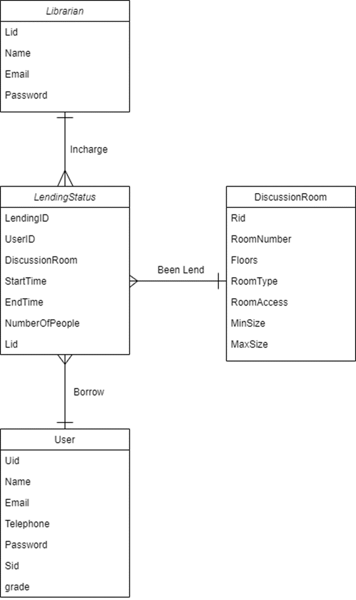

# LDRLS Server

## 簡介
這是一個圖書館場地租借系統的後端，使用 Ktor Server 框架實作。

## 功能
- [ ] 註冊
- [ ] 註銷
- [ ] 登入
- [ ] 登出
- [ ] 新增場地
- [ ] 查詢場地
- [ ] 查詢可租借場地時間
- [ ] 新增租借場地
- [ ] 修改場地
- [ ] 取消租借場地

## 架構


## 環境
- Ktor Server
- Mongo DB
- Docker

## 部署
### Docker
```
TODO: Environment Variables
docker-compose up --build -d
```

### Local
```
TODO: 本地端部署, Environment Variables
```